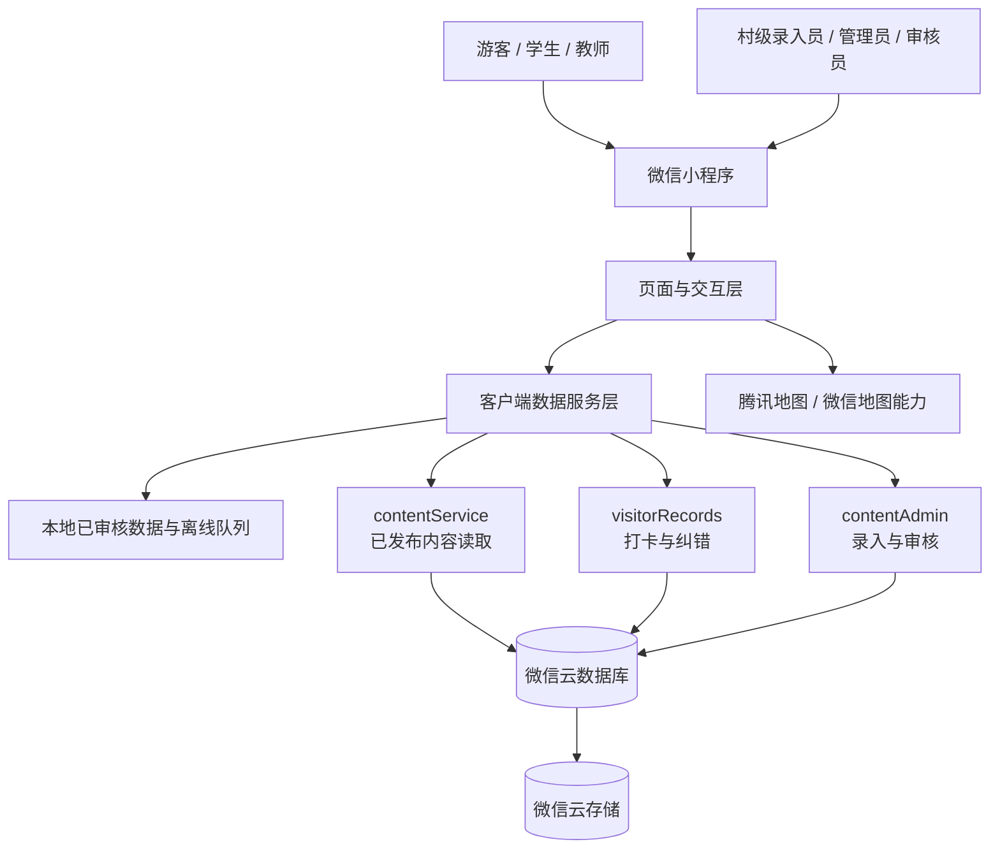
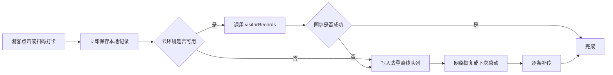
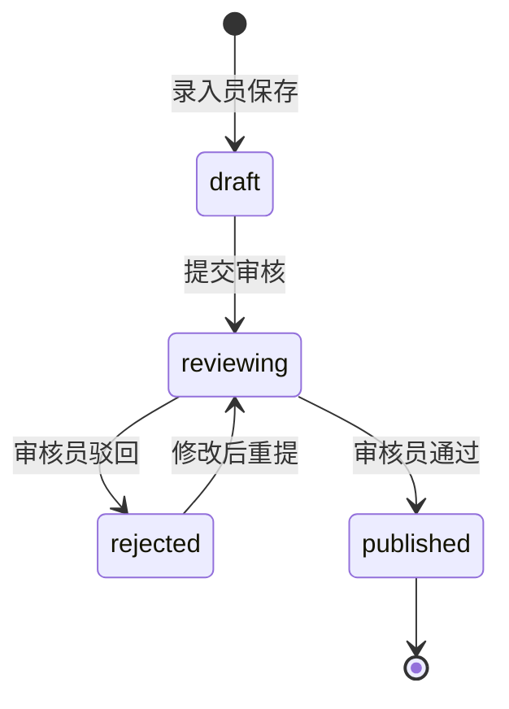

# 红韵乔林技术架构与核心流程

## 1. 总体架构

## 2. 客户端分层

- 页面层：地图、村落详情、旧址详情、红色故事、实景相册、研学路线、路线推荐。
- 数据服务层：统一处理云端读取、本地降级、离线队列和数据格式转换。
- 本地数据层：保存已审核核心资料、关怀模式状态、打卡记录和待同步任务。
- 平台能力层：定位、地图导航、扫码、图片预览、云函数、网络状态。

## 3. 云函数职责

### contentService

- 只允许读取白名单集合。
- 只返回 `published` 状态内容。
- 不向游客端暴露管理员和审核数据。

### visitorRecords

- 每次请求使用微信上下文识别用户。
- 对同一路线、同一点位打卡去重。
- 保存游客纠错，限制文本和附件数量。
- 不接受客户端伪造openid。

### contentAdmin

- 从 `adminRoles` 集合读取服务端角色。
- 录入员保存草稿并提交审核。
- 团队管理员查看和整理审核队列。
- 只有审核员可以发布或驳回正式资料。

## 4. 打卡离线同步流程

## 5. 资料审核流程

## 6. 稳定性与安全策略

- 首屏优先读取本地内容，避免等待网络造成白屏。
- 云端失败自动降级，本地打卡先成功再异步同步。
- 云函数采用动作、集合、角色和输入四层校验。
- 历史内容只有审核通过后才对游客发布。
- 位置仅用于即时距离和导航，不默认存储游客轨迹。
- 仓库忽略本机私人配置，不提交密码和密钥。

